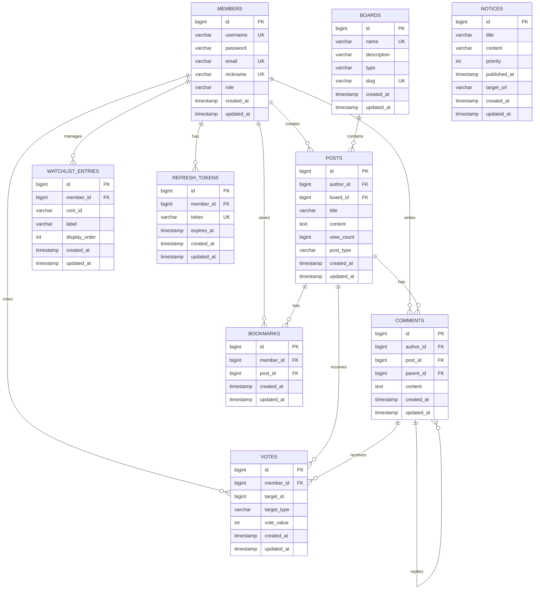

# 🪙 Johnbeo - 암호화폐 커뮤니티 플랫폼

[](https://openjdk.java.net/)
[](https://spring.io/projects/spring-boot)
[](https://gradle.org/)

암호화폐 시장 정보와 커뮤니티 기능을 결합한 종합 플랫폼입니다.

## 📋 목차

- [주요 기능](#-주요-기능)
- [기술 스택](#-기술-스택)
- [시스템 아키텍처](#-시스템-아키텍처)
- [ERD](#-erd)
- [Use Case](#-use-case)
- [설치 및 실행](#-설치-및-실행)
- [API 문서](#-api-문서)
- [프로젝트 구조](#-프로젝트-구조)

## ✨ 주요 기능

### 🔐 사용자 인증 및 권한 관리
- JWT 기반 인증 시스템 (Access Token + Refresh Token)
- 회원가입, 로그인, 로그아웃
- 역할 기반 접근 제어 (ROLE_USER, ROLE_ADMIN)

### 💰 암호화폐 시장 정보
- CoinGecko API 연동을 통한 실시간 시세 정보
- TradingView 차트 통합
- 코인 상세 정보 및 시장 데이터 조회
- 가격 차트 및 히스토리 데이터

### 👁️ 관심 코인 관리 (Watchlist)
- 개인 맞춤형 관심 코인 목록 관리
- 실시간 가격 업데이트
- USD/KRW 환율 자동 변환
- 드래그 앤 드롭을 통한 순서 조정

### 📝 커뮤니티 게시판
- 다중 게시판 시스템 (자유게시판, 뉴스, 분석 등)
- 게시글 CRUD 기능
- 조회수 추적
- 게시글 검색 및 페이지네이션

### 💬 댓글 시스템
- 댓글 및 대댓글 (계층 구조) 지원
- 댓글 수정 및 삭제
- 작성자 정보 표시

### 👍 투표 시스템
- 게시글 및 댓글 추천/비추천
- 중복 투표 방지
- 실시간 투표 집계

### 🔖 북마크
- 관심 게시글 저장
- 북마크 목록 조회
- 빠른 접근 가능

### 🔔 공지사항
- 우선순위 기반 공지사항 관리
- 시간 기반 게시 스케줄링
- 관리자 전용 기능

### 👤 회원 프로필
- 프로필 정보 조회
- 작성한 게시글 및 댓글 이력
- 활동 통계

## 🛠 기술 스택

### Backend
- **Java 17**
- **Spring Boot 3.x**
- **Spring Security** - JWT 인증
- **Spring Data JPA** - ORM
- **Hibernate** - JPA 구현체
- **QueryDSL** - 타입 안전 쿼리

### Database
- **H2 Database** (개발)
- **PostgreSQL/MySQL** (프로덕션)

### Build Tool
- **Gradle 8.x**

### External APIs
- **CoinGecko API** - 암호화폐 시장 데이터
- **TradingView Widget** - 차트 시각화

### Frontend
- **Thymeleaf** - 서버 사이드 템플릿 엔진
- **HTML5/CSS3**
- **JavaScript**
- **Bootstrap** - UI 프레임워크

### DevOps
- **Spring Boot Actuator** - 모니터링
- **Lombok** - 코드 간소화
- **JUnit 5** - 테스트 프레임워크

## 🏗 시스템 아키텍처

```
┌─────────────────────────────────────────────────────────────┐
│                         Client Layer                        │
│              (Web Browser - Thymeleaf Templates)            │
└─────────────────────────────────────────────────────────────┘
                              ↓
┌─────────────────────────────────────────────────────────────┐
│                     Presentation Layer                      │
│  ┌──────────────┐  ┌──────────────┐  ┌──────────────┐     │
│  │ View         │  │ REST API     │  │ Security     │     │
│  │ Controllers  │  │ Controllers  │  │ Filters      │     │
│  └──────────────┘  └──────────────┘  └──────────────┘     │
└─────────────────────────────────────────────────────────────┘
                              ↓
┌─────────────────────────────────────────────────────────────┐
│                      Business Layer                         │
│  ┌──────────┐ ┌──────────┐ ┌──────────┐ ┌──────────┐      │
│  │ Post     │ │ Member   │ │ Crypto   │ │ Auth     │      │
│  │ Service  │ │ Service  │ │ Service  │ │ Service  │      │
│  └──────────┘ └──────────┘ └──────────┘ └──────────┘      │
│  ┌──────────┐ ┌──────────┐ ┌──────────┐ ┌──────────┐      │
│  │ Comment  │ │ Vote     │ │Watchlist │ │ Bookmark │      │
│  │ Service  │ │ Service  │ │ Service  │ │ Service  │      │
│  └──────────┘ └──────────┘ └──────────┘ └──────────┘      │
└─────────────────────────────────────────────────────────────┘
                              ↓
┌─────────────────────────────────────────────────────────────┐
│                    Persistence Layer                        │
│  ┌──────────────────────────────────────────────────┐      │
│  │           Spring Data JPA Repositories           │      │
│  └──────────────────────────────────────────────────┘      │
└─────────────────────────────────────────────────────────────┘
                              ↓
┌─────────────────────────────────────────────────────────────┐
│                      Database Layer                         │
│              (H2 / PostgreSQL / MySQL)                      │
└─────────────────────────────────────────────────────────────┘
           ↓                                    ↓
┌──────────────────┐                 ┌──────────────────┐
│  External APIs   │                 │      Cache       │
│  - CoinGecko     │                 │   (Spring Cache) │
│  - TradingView   │                 └──────────────────┘
└──────────────────┘
```

## 📊 ERD



## 🎯 Use Case

### 사용자 (User)

```
┌─────────────────────────────────────────────────────────────────┐
│                         사용자 (User)                            │
└─────────────────────────────────────────────────────────────────┘
    │
    ├─── 회원가입
    ├─── 로그인/로그아웃
    │
    ├─── 암호화폐 정보 조회
    │    ├─── 시장 목록 보기
    │    ├─── 코인 상세 정보 보기
    │    └─── 가격 차트 보기
    │
    ├─── 관심 코인 관리
    │    ├─── 관심 코인 추가
    │    ├─── 관심 코인 삭제
    │    ├─── 순서 변경
    │    └─── 실시간 시세 확인
    │
    ├─── 게시판 이용
    │    ├─── 게시글 목록 보기
    │    ├─── 게시글 검색
    │    ├─── 게시글 작성
    │    ├─── 게시글 수정/삭제 (본인 글)
    │    └─── 게시글 조회
    │
    ├─── 댓글 기능
    │    ├─── 댓글 작성
    │    ├─── 대댓글 작성
    │    └─── 댓글 수정/삭제 (본인 댓글)
    │
    ├─── 투표 기능
    │    ├─── 게시글 추천/비추천
    │    └─── 댓글 추천/비추천
    │
    ├─── 북마크 관리
    │    ├─── 게시글 북마크 추가
    │    ├─── 북마크 삭제
    │    └─── 북마크 목록 보기
    │
    └─── 프로필 관리
         ├─── 내 프로필 보기
         ├─── 작성 글 보기
         └─── 작성 댓글 보기
```

### 관리자 (Admin)

```
┌─────────────────────────────────────────────────────────────────┐
│                        관리자 (Admin)                            │
└─────────────────────────────────────────────────────────────────┘
    │
    ├─── 모든 사용자 기능 +
    │
    ├─── 게시판 관리
    │    ├─── 게시판 생성/수정/삭제
    │    ├─── 모든 게시글 수정/삭제
    │    └─── 게시판 카테고리 관리
    │
    ├─── 공지사항 관리
    │    ├─── 공지사항 작성
    │    ├─── 공지사항 수정/삭제
    │    └─── 우선순위 설정
    │
    └─── 회원 관리
         ├─── 회원 정보 조회
         └─── 권한 관리
```

## 🚀 설치 및 실행

### 사전 요구사항

- Java 17 이상
- Gradle 8.x
- 데이터베이스 (H2/PostgreSQL/MySQL)

### 설치 방법

1. **저장소 클론**
```bash
git clone https://github.com/yourusername/jonebeo.git
cd jonebeo
```

2. **환경 변수 설정**

`.env` 파일 생성 또는 `application.yml` 수정:

```yaml
# JWT 설정
JWT_SECRET=your-secret-key-here
JWT_ACCESS_TOKEN_EXPIRATION=1800
JWT_REFRESH_TOKEN_EXPIRATION=604800

# 데이터베이스 설정
spring.datasource.url=jdbc:h2:mem:testdb
spring.datasource.username=sa
spring.datasource.password=

# CoinGecko API (선택사항 - 공개 API 사용)
coingecko.base-url=https://api.coingecko.com/api/v3
```

3. **빌드**
```bash
./gradlew build
```

4. **실행**
```bash
./gradlew bootRun
```

또는

```bash
java -jar build/libs/johnbeo-0.0.1-SNAPSHOT.jar
```

5. **접속**
```
http://localhost:8080
```

### 개발 모드 실행

```bash
./gradlew bootRun --args='--spring.profiles.active=dev'
```

### 테스트 실행

```bash
./gradlew test
```

## 📚 API 문서

### 인증 API

#### 회원가입
```http
POST /api/auth/register
Content-Type: application/json

{
  "username": "user123",
  "password": "password123",
  "email": "user@example.com",
  "nickname": "닉네임"
}
```

#### 로그인
```http
POST /api/auth/login
Content-Type: application/json

{
  "username": "user123",
  "password": "password123"
}
```

### 게시글 API

#### 게시글 목록 조회
```http
GET /api/boards/{boardId}/posts?page=0&size=20&sort=createdAt,desc
```

#### 게시글 상세 조회
```http
GET /api/posts/{postId}
```

#### 게시글 작성
```http
POST /api/boards/{boardId}/posts
Authorization: Bearer {accessToken}
Content-Type: application/json

{
  "title": "게시글 제목",
  "content": "게시글 내용"
}
```

### 암호화폐 API

#### 시장 데이터 조회
```http
GET /api/crypto/markets?page=1&perPage=100
```

#### 코인 상세 정보
```http
GET /api/crypto/coins/{coinId}
```

#### 가격 차트 데이터
```http
GET /api/crypto/coins/{coinId}/chart?days=7
```

### 관심 코인 API

#### 관심 코인 목록 조회
```http
GET /api/watchlist
Authorization: Bearer {accessToken}
```

#### 관심 코인 추가
```http
POST /api/watchlist
Authorization: Bearer {accessToken}
Content-Type: application/json

{
  "coinId": "bitcoin",
  "label": "비트코인"
}
```

## 📁 프로젝트 구조

```
src/
├── main/
│   ├── java/com/johnbeo/johnbeo/
│   │   ├── auth/                      # 인증 관련
│   │   │   ├── controller/
│   │   │   ├── service/
│   │   │   ├── dto/
│   │   │   ├── entity/
│   │   │   └── repository/
│   │   │
│   │   ├── security/                  # 보안 설정
│   │   │   ├── config/
│   │   │   ├── jwt/
│   │   │   ├── handler/
│   │   │   ├── model/
│   │   │   └── service/
│   │   │
│   │   ├── domain/                    # 도메인 모델
│   │   │   ├── member/                # 회원
│   │   │   ├── board/                 # 게시판
│   │   │   ├── post/                  # 게시글
│   │   │   ├── comment/               # 댓글
│   │   │   ├── vote/                  # 투표
│   │   │   ├── bookmark/              # 북마크
│   │   │   ├── watchlist/             # 관심 코인
│   │   │   ├── notice/                # 공지사항
│   │   │   └── feed/                  # 피드
│   │   │
│   │   ├── cryptodata/                # 암호화폐 데이터
│   │   │   ├── controller/
│   │   │   ├── service/
│   │   │   ├── dto/
│   │   │   └── config/
│   │   │
│   │   ├── web/                       # 웹 컨트롤러
│   │   │   ├── controller/
│   │   │   └── request/
│   │   │
│   │   ├── common/                    # 공통 유틸리티
│   │   │   ├── config/
│   │   │   ├── entity/
│   │   │   ├── exception/
│   │   │   └── response/
│   │   │
│   │   └── JohnbeoApplication.java    # 메인 애플리케이션
│   │
│   └── resources/
│       ├── templates/                 # Thymeleaf 템플릿
│       │   ├── auth/
│       │   ├── board/
│       │   ├── post/
│       │   ├── member/
│       │   ├── market/
│       │   ├── coins/
│       │   ├── watchlist/
│       │   ├── home/
│       │   └── fragments/
│       │
│       ├── static/                    # 정적 리소스
│       │   ├── css/
│       │   └── js/
│       │
│       ├── application.yml            # 기본 설정
│       ├── application-dev.yml        # 개발 환경 설정
│       ├── application-prod.yml       # 프로덕션 설정
│       └── application.properties
│
└── test/                              # 테스트 코드
    ├── java/
    └── resources/
```

## 🔑 주요 기술 구현

### JWT 인증 플로우
1. 사용자 로그인 → Access Token + Refresh Token 발급
2. 요청 시 Access Token 검증
3. Access Token 만료 시 Refresh Token으로 재발급
4. Cookie 기반 토큰 저장

### 캐싱 전략
- Spring Cache 활용
- 암호화폐 시장 데이터 캐싱
- 공지사항 캐싱
- TTL 기반 캐시 무효화

### 계층형 댓글 구조
- 부모-자식 관계 매핑
- 재귀적 댓글 로딩
- 삭제 시 연쇄 삭제 처리

### 투표 시스템
- 중복 투표 방지 (Unique Constraint)
- 투표 변경 가능 (추천 ↔ 비추천)
- 집계 데이터 실시간 계산

## 🧪 테스트

프로젝트는 다양한 레벨의 테스트를 포함합니다:

- **단위 테스트**: Service 레이어 테스트
- **통합 테스트**: Controller + Service + Repository
- **API 테스트**: REST API 엔드포인트 테스트

테스트 커버리지 주요 영역:
- ✅ PostService
- ✅ CommentService
- ✅ BookmarkService
- ✅ VoteService
- ✅ WatchlistService
- ✅ CryptoDataService
- ✅ NoticeService

## 🤝 기여

기여를 환영합니다! 다음 절차를 따라주세요:

1. Fork the Project
2. Create your Feature Branch (`git checkout -b feature/AmazingFeature`)
3. Commit your Changes (`git commit -m 'Add some AmazingFeature'`)
4. Push to the Branch (`git push origin feature/AmazingFeature`)
5. Open a Pull Request

## 📝 라이선스

This project is licensed under the MIT License.

## 👨‍💻 개발자

**Johnbeo Team**

## 📧 문의

프로젝트에 대한 문의사항이 있으시면 이슈를 등록해주세요.

---

Made with ❤️ by Johnbeo Team

